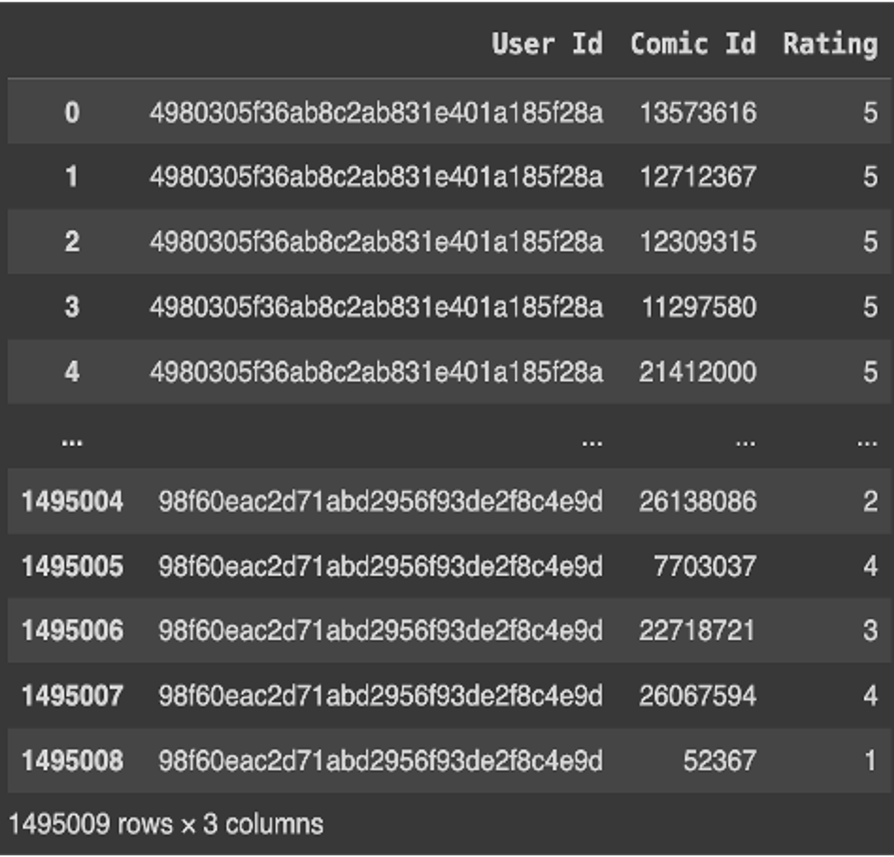
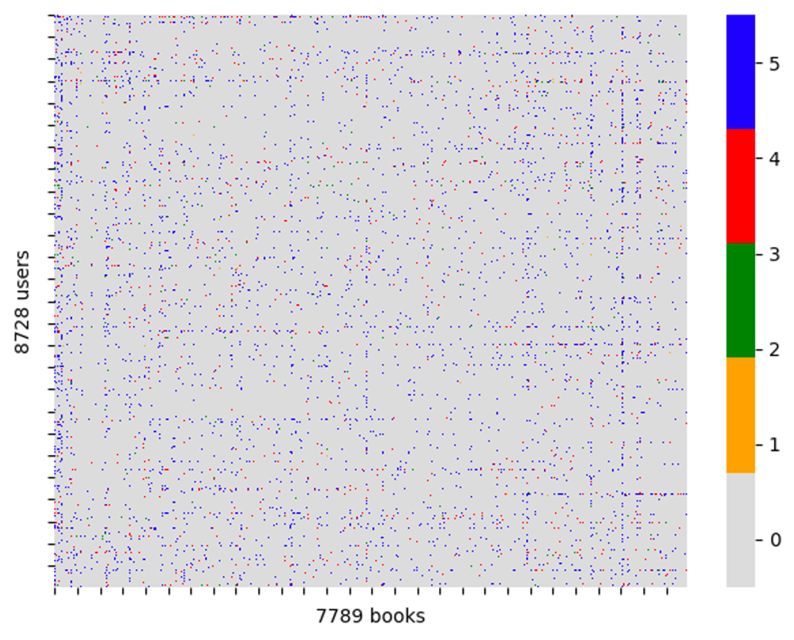
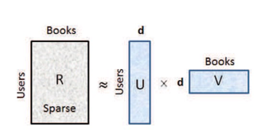

# dsc_210_course_project

## Dataset:
The Goodreads Book Review Dataset, a valuable resource for understanding reader preferences and interactions, 
encompasses a rich collection of book reviews and user-generated data gathered from the Goodreads website.  
This dataset, compiled in late 2017, provides insights into the diverse ways readers engage with books and the 
factors that influence their reading choices.

Source: GoodReads Website

Genre: Comics & Graphic Novels  
89,411 books  
542,338 detailed reviews  

DataFrame is transformed to the User Item Matrix. The User Item Matrix for our problem is sparse as you can see below.

### ** The main data file used to build all the models cannot be uploaded to Github as the size is greater than 100 MB. **

## Appraoches utilized:

### SVD:

### SVD++:
